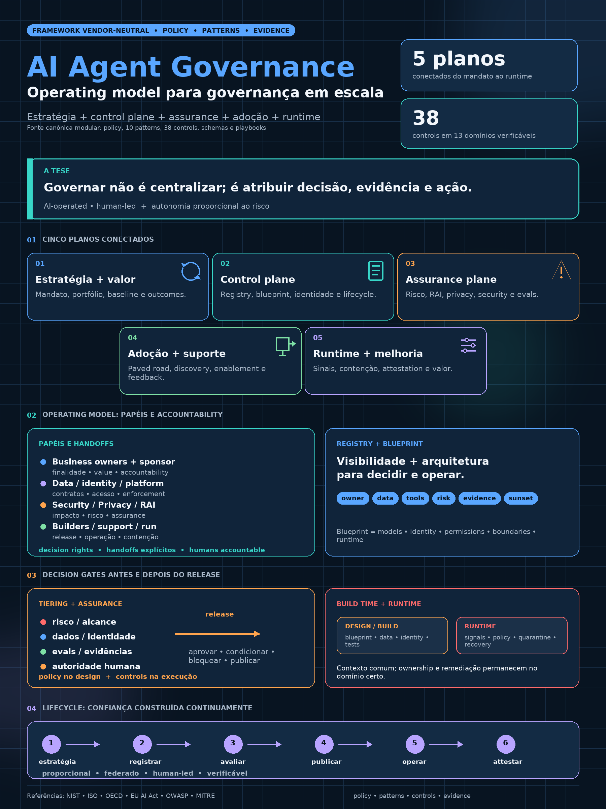

# AI Agent Governance Framework

**Framework vendor-neutral para governar sistemas de IA e agentes do mandato executivo ao runtime.**

Este repositório reúne policy, operating model, arquitetura, design patterns, controles, assessments, schemas e templates em uma única fonte canônica. O mesmo conteúdo pode ser consumido como referência técnica, guia de implantação, handbook e base para futuras publicações.

> **Status normativo:** a [policy modular](docs/governance/policy.md) é a fonte canônica em evolução. Uma organização só deve declarar uma release como adotada após aprovação explícita e versionada pela authority competente.

## O problema que o framework resolve

Agentes combinam modelos probabilísticos, dados, identidades, ferramentas e capacidade de ação. Sem um sistema de governança, a organização perde respostas básicas:

- o que existe, por que existe e quem responde;
- quais dados, tools, APIs e MCP servers podem ser usados;
- qual autonomia e blast radius foram aprovados;
- quais testes e evidências sustentam a publicação;
- como detectar desvio, conter, remediar e aposentar;
- se criação, adoção, qualidade e valor estão sendo medidos separadamente.

O framework conecta essas respostas em um lifecycle verificável e proporcional ao risco.

## Cinco planos conectados

1. **Estratégia e valor** — mandato, portfólio, owner, hipótese e métricas.
2. **Control plane** — registry, blueprint, identidade, policy e lifecycle.
3. **Assurance plane** — risco, Responsible AI, privacy, security e avaliações.
4. **Adoção e suporte** — enablement, change, suporte e feedback.
5. **Runtime e melhoria** — telemetria, incidentes, contenção, attestation e valor.

Control plane e assurance plane são complementares. Inventário, identidade e telemetria não comprovam, sozinhos, segurança, equidade, transparência ou impacto responsável.

## Comece pelo seu objetivo

| Se você precisa... | Comece aqui |
|---|---|
| entender o framework em 20 minutos | [Brief executivo](docs/executive/governing-agents-at-scale.md) |
| estudar a referência completa | [Handbook e ordem de leitura](docs/handbook/README.md) |
| implantar a governança | [Implementation playbook](docs/guides/framework-implementation-playbook.md) |
| executar os primeiros 90 dias | [Roadmap de 90 dias](docs/guides/implementation-plan-90-days.md) |
| avaliar maturidade | [Maturity model](docs/guides/maturity-model.md) |
| reutilizar soluções arquiteturais | [Catálogo de design patterns](docs/patterns/README.md) |
| adotar controles verificáveis | [Control catalog](controls/README.md) |
| registrar agentes e arquitetura | [Schemas e exemplos](schemas/README.md) |
| conhecer a produtificação comercial separada | [Consultoria: três pacotes e nove módulos](consulting/README.md) |
| estudar uma referência externa opcional | [Caso Microsoft Customer Zero](docs/explanations/microsoft-agent-governance-case-study.md) |

## Toolkit

| Artefato | Uso |
|---|---|
| [Policy modular](docs/governance/policy.md) | entrada normativa, composição, boundaries e versionamento |
| [Operating model](docs/governance/operating-model.md) | papéis, decision rights, fóruns e handoffs |
| [Arquitetura](docs/architecture/overview.md) | planos, fluxos e boundaries |
| [Patterns](docs/patterns/README.md) | soluções recorrentes e antipatterns |
| [Control catalog](controls/README.md) | requisitos, implementações e evidências |
| [Registry + blueprint](schemas/README.md) | inventário, arquitetura e accountability estruturados |
| [Assessments](assessments/README.md) | risco, maturidade e comparações |
| [Templates](templates/README.md) | execução humana e evidências |
| [Handbook](docs/handbook/README.md) | ordem editorial para leitura linear e futura publicação |

## Princípios não negociáveis

- **AI-operated, human-led:** automação não remove accountability humana.
- **Proporcionalidade:** controles crescem com alcance, autonomia, criticidade, dados, irreversibilidade e capacidade de ação.
- **Governança distribuída:** negócio, identidade, dados, segurança, plataforma, Responsible AI e operações preservam seus decision rights.
- **Build time ≠ runtime:** release gates não substituem observabilidade e contenção.
- **Registry ≠ governança completa:** inventário precisa de ownership, lifecycle, assurance e remediação.
- **Visibilidade deve levar à ação:** dashboard sem owner, SLA e workflow é apenas observação.
- **Valor exige evidência:** volume de agentes não prova adoção, qualidade ou retorno.
- **Vendor-neutral core:** produtos implementam capacidades; não definem o framework.

## Preparado para publicação futura

Os documentos modulares permanecem como fonte canônica e o [handbook](docs/handbook/README.md) define uma ordem editorial estável. Quando o conteúdo estiver maduro, PDF, EPUB ou outros formatos devem ser gerados a partir dessa fonte — nunca mantidos como cópias editoriais independentes.

## Camada comercial separada

A produtificação pessoal deste conhecimento está em [`consulting/`](consulting/README.md), organizada em três pacotes compostos por nove módulos. Ela deriva do framework, mas não integra a policy, o handbook ou a comunicação executiva canônica.

O framework **não é certificação**, parecer jurídico, garantia de conformidade nem promessa de retorno financeiro. Resultados dependem de contexto, implementação, adoção e evidência observável.

## Origem e limites

O framework surgiu de trabalho aplicado de governança de agentes em contexto industrial e evoluiu com referências públicas como NIST AI RMF, ISO/IEC 42001 e 23894, OECD AI Principles, EU AI Act, OWASP GenAI e MITRE ATLAS. O [caso Microsoft](docs/explanations/microsoft-agent-governance-case-study.md) é evidência institucional útil, não auditoria independente nem arquitetura universal.

## Navegação

- [Índice completo e jornadas por persona](docs/index.md)
- [Roadmap do produto de conhecimento](ROADMAP.md)
- [Glossário](references/glossary.md)
- [Fontes](references/sources.md)
- [Como contribuir](CONTRIBUTING.md)

## Licença

[Creative Commons Attribution 4.0 International](LICENSE) — uso, adaptação e compartilhamento permitidos com atribuição.

## Autor

**Rodrigo Garcia Guimarães**  
Infrastructure Senior Architect | AI Governance | Hybrid Cloud & Industrial Edge  
[LinkedIn](https://linkedin.com/in/rodgui) · [GitHub](https://github.com/rodgui)
