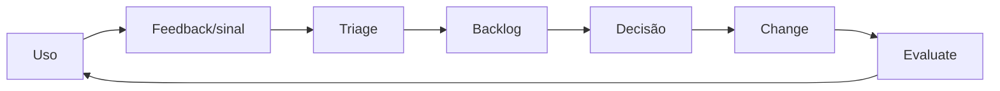

# Adoção, enablement e suporte

## Objetivo

Preparar builders, usuários, líderes e suporte para criar, descobrir, usar e operar capacidades de IA com segurança e efetividade.

Adoção não é comunicação de lançamento. É a capacidade organizacional de usar o sistema de forma correta, obter suporte, reportar falhas e incorporar feedback ao governance lifecycle.

## Personas

| Persona | Necessidade |
|---|---|
| sponsor | value, risco, decisões e accountability |
| business owner | outcome, usuários, limites e attestation |
| maker/engineer | paved road, controls, templates e feedback rápido |
| end user | intended use, limitações, suporte e contestação |
| administrator | policy, inventory, access e remediation |
| support | triage, known issues, escalation e communication |
| domain authority | evidências relevantes e decision rights |
| auditor | acesso independente a records e rationale |

## Discovery e catalog

Um catálogo útil permite:

- encontrar capacidades aprovadas por tarefa e persona;
- distinguir status, owner, versão e tier;
- entender intended/prohibited use;
- acessar support e feedback;
- evitar duplicação;
- ocultar ou bloquear itens em quarantine/sunset;
- medir discovery separado de criação.

Publicar sem discovery gera agentes invisíveis; discovery sem lifecycle promove itens inadequados.

## Paved road para builders

- starter templates com identity, logging e policy hooks;
- schemas e self-assessment proporcionais;
- approved models, data connectors e tools;
- automated checks com feedback acionável;
- sandbox e test datasets;
- design clinic e office hours;
- exception process com owner e expiry;
- documentação de examples e failure modes.

O paved road deve ser mais simples que contornar a governança.

## Suporte em camadas

1. **Self-service:** documentação, status, FAQ e runbooks.
2. **AI-assisted:** busca e triage com handoff rastreável.
3. **Platform/IT backstop:** incidentes, acesso e operação.
4. **Domain SME:** security, privacy, RAI, legal, data ou negócio.
5. **Authority escalation:** containment, risk acceptance e policy decision.

## Change e comunicação

Mudanças materiais comunicam:

- o que mudou e por quê;
- quem é afetado;
- novos limites ou ações;
- data de vigência;
- treinamento ou suporte necessário;
- rollback/contingency;
- canal de feedback e owner.

## Feedback loop

Feedback é evidência contextual, não prova isolada de valor ou segurança.

## Evidências

- persona e stakeholder map;
- adoption/support plan;
- catalog entry e discovery analytics;
- learning assets;
- support model e escalation;
- training/competence records;
- feedback backlog e decisões;
- change communication;
- user research e accessibility findings.

## Métricas

- discovery-to-use conversion;
- active/recurring users por persona;
- duplicate creation;
- support demand e resolution time;
- training completion e task competence;
- misuse/incorrect-use reports;
- feedback-to-decision time;
- adoption com qualidade e outcome, não apenas login.

## Failure modes

- medir sucesso por agentes criados;
- publicar sem owner ou suporte;
- treinamento único para todos;
- champion network sem authority ou tempo;
- usar feedback positivo como prova de ROI;
- esconder limitation para aumentar adoção;
- ignorar resistência como “falta de cultura”;
- manter itens em discovery durante quarantine.

## Decision gate

Release para audiência ampla exige catalog entry, intended use, limitations, support owner, escalation, communication e feedback channel.
