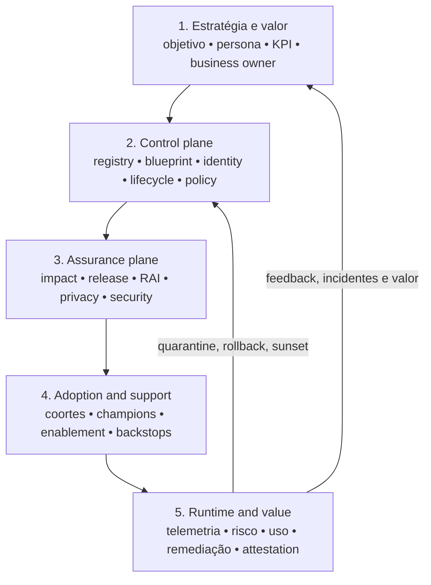
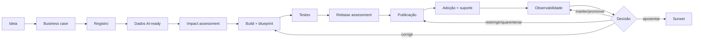

# Arquitetura de referência para governança de agentes

## Status desta arquitetura

Este documento integra a [policy de governança de agentes](../governance/policy.md) como arquitetura canônica do framework. A adoção normativa de uma release continua dependendo da authority competente.

## Objetivo

Conectar estratégia, dados, controles, Responsible AI, adoção, suporte e operação em um único fluxo verificável. O modelo define capabilities e boundaries independentes de produto; qualquer plataforma é uma implementação substituível e opcional.

A ligação entre estas capabilities e os sistemas que a organização já opera é artefato separado, por decisão: [mapeamento de capability para tecnologia](capability-to-technology.md). Mantê-lo fora daqui é o que permite trocar de produto sem reescrever a arquitetura.

Duas leituras complementam esta arquitetura: os [atributos de qualidade](quality-attributes.md) que ela precisa sustentar e os [riscos arquiteturais](risks.md) que ela assume. Uma arquitetura sem atributo declarado não pode ser avaliada; sem risco declarado, não pode ser desafiada.

## Modelo em cinco planos

### 1. Estratégia e valor

Define por que o agente existe, qual processo afeta, quem responde pelo resultado e como sucesso ou fracasso serão medidos.

**Artefatos:** business case, persona, baseline, KPI, owner, critérios de sunset.

### 2. Control plane

Mantém a visão compartilhada de agentes, ownership, identidade, capacidades, dados, conectores, lifecycle e ações administrativas.

**Artefatos:** registry, agent blueprint, identity record, policy template, attestation.

### 3. Assurance plane

Avalia impactos, riscos, mitigadores, testes e accountability antes e durante a operação.

**Artefatos:** self-assessment, impact assessment, release assessment, threat model, evidence package, waiver.

### 4. Adoption and support plane

Prepara builders, usuários, líderes e suporte para criar, descobrir, usar e operar agentes com segurança.

**Artefatos:** adoption plan, coortes, learning assets, champion network, support model, feedback backlog.

### 5. Runtime and value plane

Observa comportamento, segurança, acesso, performance, uso e valor; executa remediação e realimenta decisões.

**Artefatos:** logs, dashboards, alerts, incidents, quarantine, rollback, value review, retirement decision.

## Domínios canônicos por plano

Os cinco planos são a arquitetura. Os domínios canônicos são a organização editorial e de ownership do corpus. Um domínio pertence a um plano principal, mas quase sempre produz evidência consumida por outros.

| Plano | Domínios canônicos |
|---|---|
| 1. Estratégia e valor | [estratégia, portfólio e valor](../value/README.md) |
| 2. Control plane | [estate e registry](../registry/README.md) · [lifecycle](../lifecycle/README.md) · [identidade](../identity/README.md) · [dados](../data-access/README.md) · [tools e MCP](../tool-governance/README.md) · [modelos e provedores](../model-governance/README.md) |
| 3. Assurance plane | [risco](../risk-management/README.md) · [Responsible AI](../responsible-ai/README.md) · [segurança](../security/README.md) · [evaluations](../evaluations/README.md) · [human oversight](../human-oversight/README.md) |
| 4. Adoção e suporte | [adoção e enablement](../adoption/README.md) |
| 5. Runtime e valor | [operações e resposta](../operations/README.md) · [auditabilidade](../auditability/README.md) |

Um domínio novo só se justifica quando altera decisão, authority, control ou evidência. Subdividir por afinidade temática, sem consequência operacional, aumenta manutenção sem aumentar governança.

## Fluxo ponta a ponta

## Matriz de proporcionalidade

O grau de governança deve aumentar quando cresce qualquer uma destas dimensões:

- alcance e número de usuários;
- sensibilidade e criticidade dos dados;
- escrita, ação ou automação de workflows;
- interconectividade e uso de APIs/MCP;
- irreversibilidade;
- impacto financeiro, operacional, legal ou humano;
- autonomia;
- distribuição regional e exposição externa.

O modelo combina autonomia, blast radius, capacidade de ação, criticidade, reversibilidade, dados e alcance. Taxonomias organizacionais adicionais podem ser mapeadas sem alterar a arquitetura.

## Boundaries

### O control plane deve

- consolidar contexto;
- reconciliar inventário;
- expor postura e sinais;
- acionar workflows e ferramentas especializadas;
- registrar evidências e decisões.

### O control plane não deve

- substituir sistemas de identidade ou DLP;
- decidir sozinho risco residual;
- transformar telemetria incompleta em falsa certeza;
- centralizar toda responsabilidade em um único time;
- confundir uso com valor.

## Princípios arquiteturais

1. **Proporcional:** controles crescem com risco e capacidade.
2. **Embedded by default:** guardrails entram nas ferramentas e pipelines.
3. **Human-led:** accountability e julgamento permanecem humanos.
4. **Observable and remediable:** toda autonomia relevante precisa de sinal e ação.
5. **Federated with common controls:** domínios mantêm ownership; padrões comuns preservam confiança.
6. **Lifecycle-aware:** criação, mudança, attestation e sunset são partes do mesmo sistema.
7. **Platform-agnostic:** a policy é comum; adapters e evidências variam por plataforma.

## Playbook do runtime control plane

O control plane transforma os standards dos demais domínios em enforcement técnico. A arquitetura precisa deixar explícito **onde** autenticação, policy, acesso a modelo, mediação de ferramentas, egress, rate limit, logging e contenção realmente acontecem.

1. **Separar management plane de runtime plane.** O primeiro guarda registry, policy, lifecycle e configuração; o segundo executa sessões, recuperação, modelos e ferramentas. A separação revela onde cada controle deve residir.
2. **Definir pontos de enforcement comuns.** Gateways e brokers para modelos, ferramentas e egress onde isso reduzir bypass. Nem todo tráfego precisa passar por um único componente, mas **toda rota de produção precisa de enforcement conhecido**.
3. **Modelar o fluxo ponta a ponta por tier.** Gatilho → agente → identidade → dados/ferramenta/modelo → policy → telemetria → resposta. Desenhar ao menos um fluxo T1, um T2 e um T3 para verificar que nenhum controle depende de conhecimento implícito.
4. **Implementar isolamento e fronteiras de rede.** Egress, endpoints privados, separação de ambientes, fronteira de secrets e acesso a sistemas críticos. Workloads privilegiados merecem runtime isolado e allowlists mais restritas.
5. **Definir limites operacionais.** Timeouts, máximo de chamadas e profundidade de cadeia, concorrência, política de retry, limite de contexto, budget e circuit breaker. **São controles de resiliência e custo, não tuning.**
6. **Projetar fallback e comportamento de falha.** Decidir o que acontece quando modelo, índice, ferramenta ou identidade falham. Fail-closed pode ser obrigatório em ação crítica; em leitura pode haver degradação controlada — mas a escolha é explícita.
7. **Padronizar correlation IDs e telemetria.** Uma execução precisa ser rastreável por tarefa, sessão, agente, usuário, modelo, ferramenta e policy. Sem correlação, segurança, custo e valor ficam em silos.
8. **Validar por teste e cenário de ameaça.** Exercitar falha de componente, bypass de policy, negação de permissão, loop descontrolado, indisponibilidade de provedor e quarentena. **A arquitetura de referência só está pronta quando os padrões são demonstráveis em um piloto.**

## Visual consolidado

A fonte reproduzível está em [`tools/scripts/render-agent-governance-infographic.py`](../../tools/scripts/render-agent-governance-infographic.py).

## Próximos passos

- aprovar mandato, escopo, sponsorship e risk appetite;
- executar o [plano de 90 dias](../guides/implementation-plan-90-days.md);
- implantar registry, blueprint e risk tiering no portfólio inicial;
- validar decision gates, containment, rollback e attestation por evidência;
- promover mudanças normativas por proposta, revisão, authority, changelog e release versionada.
