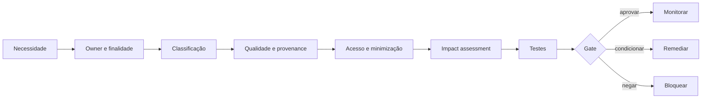

# Dados, acesso, provenance e AI-ready data

## Objetivo

Garantir que dados usados por modelos e agentes sejam permitidos, adequados à finalidade, rastreáveis, minimizados, protegidos e operáveis ao longo do lifecycle.

## AI-ready não significa apenas disponível

Uma fonte é AI-ready para um uso específico quando possui:

- owner e steward;
- classificação e finalidade permitida;
- qualidade suficiente para o outcome;
- provenance e lineage conhecidos;
- freshness e janela temporal adequadas;
- controles de acesso e segregação;
- regras de retenção e exclusão;
- cobertura de regiões, idiomas e populações relevantes;
- limitações conhecidas e forma de comunicá-las;
- mecanismo de incident, correção e revogação.

A mesma fonte pode ser adequada para busca interna e inadequada para decisão sobre pessoas.

## Data contract para agentes

Cada dataset, index, vector store, memory store ou connector deve declarar:

| Dimensão | Pergunta |
|---|---|
| finalidade | para qual tarefa e outcome o dado pode ser usado? |
| classificação | público, interno, confidencial, restrito ou regulado? |
| subject | há dados pessoais, sensíveis ou de terceiros? |
| origem | sistema de registro, fornecedor, usuário ou conteúdo gerado? |
| lineage | quais transformações e filtros foram aplicados? |
| qualidade | quais checks, thresholds e limitações existem? |
| tempo | freshness, retention, expiry e direito de exclusão? |
| acesso | quais identidades, operações e ambientes? |
| região | onde é armazenado, processado e transferido? |
| output | o que pode ser exposto, persistido ou usado para treinamento? |

## Connector gate

O gate deve existir no ponto de criação do connector e na mudança material de source, scope ou destination.

## RAG, memória e conteúdo gerado

### Retrieval

- filtrar por autorização antes de recuperar, não somente antes de exibir;
- preservar source IDs e timestamps;
- separar ranking de autorização;
- tratar conteúdo recuperado como não confiável para instruções;
- testar leakage entre usuários, grupos e tenants.

### Memória

- definir se memória é de sessão, usuário, equipe ou organização;
- limitar categorias persistidas;
- oferecer correção, exclusão e expiração;
- impedir que instruções maliciosas se tornem memória operacional;
- registrar quem escreveu, leu e alterou.

### Conteúdo gerado

- marcar quando necessário;
- controlar reutilização para treinamento;
- separar output temporário de record oficial;
- validar antes de gravação em system of record;
- preservar provenance do modelo, prompt, fontes e revisão humana quando aplicável.

## Controles mínimos

1. Data owner aprova finalidade e classes acessíveis.
2. Acesso segue least privilege e identidade do agente.
3. DLP e policy enforcement cobrem input, retrieval, output e tools.
4. Dados de produção não são copiados para testes sem autorização e proteção.
5. Prompt, log e trace são classificados como dados; não são “metadados inofensivos”.
6. Vector stores e caches possuem retention e deletion verificáveis.
7. Sources externas têm licença, termos e provenance avaliados.
8. Mudança de source, embedding, index ou policy é registrada.
9. Outputs que alteram records passam por validação compatível com o risco.
10. Incidentes de dados acionam contenção e análise de blast radius.

## Playbook de implantação

AI-ready não é sinônimo de "disponível para recuperação". Uma fonte só é certificada quando ownership, classificação, qualidade, autorização, finalidade e restrições de uso por IA são conhecidos **e operáveis**.

1. **Inventariar fontes candidatas.** Começar pelos casos do piloto e descobrir repositórios, APIs, bases estruturadas, documentos e knowledge stores. Registrar owner, sistema de origem e consumidores atuais.
2. **Classificar e confirmar a authority do owner.** Validar classificação, presença de dados pessoais ou restritos, residency, retenção e quem pode autorizar uso por IA. **Fonte sem owner ou classificação confiável vai para remediação, não para produção.**
3. **Definir critérios AI-ready observáveis.** Transformar "qualidade" em atualidade, completude, versionamento, metadados, ACL consistente, fonte autoritativa, restrições de modelo e procedimento de correção.
4. **Certificar com evidência.** Aplicar o checklist, amostrar conteúdo e permissões, registrar findings e a decisão `certified`, `conditional` ou `not-ready`. Condicional exige restrições explícitas e data de revisão.
5. **Manter catálogo e backlog.** O catálogo é o allowlist governado; o backlog contém fontes legítimas que ainda não atendem aos critérios. Ver o [exemplo preenchido](../../examples/certified-source-catalog.example.md).
6. **Separar acesso do agente do acesso do usuário.** Em recuperação e ferramentas, confirmar que o resultado respeita ACL e claims. **"O agente consegue buscar" não significa que todo usuário pode receber todo resultado.**
7. **Controlar ingestão, indexação e memória.** Decidir quais campos podem virar embedding, o que pode ser cacheado, por quanto tempo, e como exclusão ou correção na origem se propaga ao índice e à memória.
8. **Reavaliar em operação.** Nova classe de dados, mudança de owner, queda de qualidade, alteração de ACL ou troca de provedor podem invalidar a certificação. Monitorar atualidade, anomalias de acesso negado e incidentes de vazamento.

## Evidências

- data contract;
- approval do owner;
- classificação e purpose mapping;
- connector configuration;
- test cases de segregação e leakage;
- lineage/provenance records;
- DLP results;
- retention/deletion test;
- incident e correction records;
- attestation periódica.

## Métricas

- connectors sem owner, classificação ou expiry;
- respostas sem source attribution quando exigido;
- unauthorized retrieval attempts;
- leakage test failures;
- stale indexes e freshness breaches;
- registros sem lineage;
- deletion requests não propagadas;
- dados acessados mas não necessários ao outcome.

## Failure modes

- chamar todo conteúdo interno de confiável;
- usar “o usuário já tinha acesso” como única justificativa;
- indexar além do scope aprovado;
- aplicar autorização depois da retrieval;
- persistir prompts e traces indefinidamente;
- misturar memória entre personas ou tenants;
- tratar qualidade de busca como qualidade da fonte;
- permitir que output gerado se torne record oficial sem gate.

## Decision gate

Sem data contract, owner, classification, access model, retention e tests de segregação, o connector permanece bloqueado para produção.
