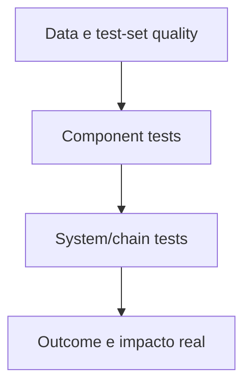
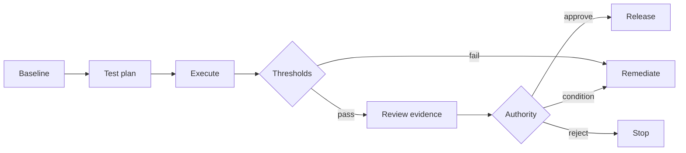

# Evaluations, quality gates e release evidence

## Objetivo

Produzir evidência de que o sistema atende ao intended use, riscos e controles antes do release e continua adequado em operação.

O perfil de GenAI do NIST destaca pre-deployment testing e incident disclosure entre suas considerações primárias.[8] O framework amplia esse princípio para agentes, tools e efeitos operacionais.

## Evaluation strategy

Uma estratégia declara:

- intended e prohibited use;
- scenarios e personas;
- quality dimensions;
- risk-based thresholds;
- datasets e provenance;
- automated e human evaluation;
- negative, adversarial e edge cases;
- slices relevantes;
- runtime metrics;
- promotion, rollback e sunset criteria.

## Pirâmide de avaliação

### Data e test set

- representatividade contextual;
- provenance e licença;
- cobertura de red flags e edge cases;
- separação de train/tune/test quando aplicável;
- versioning e leakage control.

### Component

- prompt, model, retrieval, classifier e tool separadamente;
- schema, authz, safety e output validation;
- deterministic tests para código e policy.

### System/chain

- end-to-end scenarios;
- multi-step tool use;
- indirect prompt injection;
- rollback e idempotency;
- latency, cost e failure propagation;
- human approval e escalation.

### Outcome

- qualidade no processo real;
- impacto em pessoas e grupos;
- erro operacional;
- adoção e suporte;
- valor versus baseline.

## Quality dimensions

- correctness e groundedness;
- relevance e completeness;
- safety e harmfulness;
- security e policy compliance;
- robustness e consistency;
- fairness por slices relevantes;
- transparency e citation quality;
- latency, availability e cost;
- task success e reversibility;
- human usability e override.

## Thresholds

Threshold precisa de:

- métrica e unidade;
- dataset/scenario;
- rationale;
- owner;
- minimum e target;
- action quando falha;
- validade e review trigger.

Média agregada não pode compensar falha em red flag. Gates críticos são binários quando a tolerância é zero.

## LLM-as-judge

Pode apoiar escala, desde que:

- rubric e model/version sejam registrados;
- calibração humana seja amostrada;
- bias e instability sejam medidos;
- high-impact decisions não dependam de um único judge;
- outputs sejam tratados como evidência auxiliar.

## Release evidence package

- registry e blueprint aprovados;
- risk tier e assessments aplicáveis;
- model/data/tool versions;
- test plan e datasets;
- resultados, failures e limitações;
- security e Responsible AI evidence;
- human oversight e UX evidence;
- runtime thresholds e runbooks;
- rollback/quarantine drill;
- approvals, conditions e expiry.

## Promotion gate

## Runtime evaluation

- sample quality review;
- drift de input, output, source e user behavior;
- policy denials e safety signals;
- tool success e side effects;
- incidents, complaints e overrides;
- cost/latency regressions;
- canary e rollback criteria;
- periodic attestation.

## Evidências

- versioned evaluation plan;
- test sets e provenance;
- raw e summarized results;
- failure analysis;
- human review/calibration;
- gate decision;
- runtime trend e incident feedback;
- regression suite atualizada.

## Métricas

- coverage de critical scenarios;
- pass/fail por dimension e slice;
- escaped defects/incidents;
- false positive/negative de safety controls;
- regression recurrence;
- judge-human agreement;
- time to evaluate after material change;
- agents operating with expired evidence.

## Failure modes

- demo usada como evaluation;
- test set escolhido depois de ver o resultado;
- threshold sem rationale;
- avaliar apenas output textual e ignorar tool effect;
- confiar em média agregada;
- LLM judge sem calibração;
- release approval sem raw evidence;
- não converter incidentes em regression tests.

## Sources

[8] <https://nvlpubs.nist.gov/nistpubs/ai/NIST.AI.600-1.pdf> — NIST AI 600-1 Generative AI Profile
