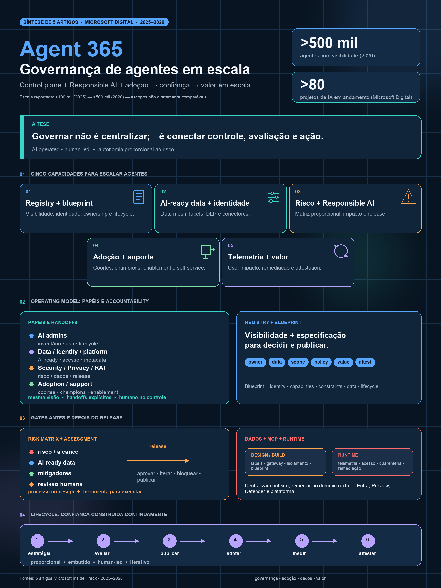

# Governar agentes em escala: da policy ao sistema operacional

## Decision requested

Usar a policy v1 como baseline de controle e autorizar uma fase de 90 dias para validar registry, blueprint, AI-ready data, matriz de risco, assessments, adoção, MCP e métricas de valor antes de propor uma v2.

## Context

A policy v1 deste repositório já estabelece fundamentos raros em iniciativas ainda imaturas: owners nominativos, autonomia L0–L3, HITL, blast radius, approval matrix, catálogo, observabilidade, quarantine, kill switch e sunset.

Uma análise de cinco artigos do Microsoft Inside Track mostra que essa direção está alinhada com a jornada interna da Microsoft. Também revela que governar agentes em escala exige capacidades que vão além da policy: dados certificados, governança embutida, adoption, suporte, identidade, telemetria e decisões de lifecycle.

## Why now

Agentes não apenas geram respostas. Eles podem acessar dados, usar credenciais, chamar ferramentas, escrever em sistemas e executar workflows. A combinação de autonomia, alcance e interconectividade transforma exceções locais em risco sistêmico.

Ao mesmo tempo, uma governança que trata todos os agentes como aplicações críticas cria filas, shadow AI e perda de confiança. O modelo precisa ser proporcional: baixo atrito para agentes de baixo risco e revisão profunda para agentes com escrita, ação, dados sensíveis ou impacto empresarial.

## Recommendation

Adotar uma arquitetura operacional em cinco planos:

1. **Estratégia e valor:** objetivo, persona, baseline, KPI e business owner.
2. **Control plane:** registry, blueprint, identidade, lifecycle e policy.
3. **Assurance plane:** impact assessment, release assessment, segurança, privacy e Responsible AI.
4. **Adoption and support:** coortes, champions, enablement, self-service e especialistas.
5. **Runtime and value:** telemetria, detecção, remediação, attestation, uso e outcomes.

Esses planos não precisam de um superadministrador. Precisam de contexto compartilhado, responsabilidades explícitas e workflows capazes de conduzir sinais até decisão e ação.

## What changes relative to policy v1

### Preserve

- Design Authority, Run Authority e human accountability;
- níveis de autonomia e HITL;
- blast radius e approval matrix;
- catálogo, observabilidade e enforcement;
- policy multiplataforma;
- lifecycle e sunset.

### Validate for v2

- agent blueprint separado do registry;
- AI-ready data e connector gates;
- matriz no-code/low-code/pro-code por capacidade;
- impact assessment versus release assessment;
- adoption lead, champions e suporte por camadas;
- MCP governance;
- attestation de equipe e lifecycle vinculado à identidade;
- métricas de criação, descoberta, uso, qualidade e valor.

## Benefits

- inovação com caminhos claros e proporcionais;
- menos agentes sem owner, duplicados ou sem uso;
- visibilidade sobre dados, ferramentas e ações;
- especialistas focados em exceções, não em todos os casos;
- melhor capacidade de quarantine, rollback e sunset;
- decisões de investimento baseadas em uso e outcomes, não em volume.

## Risks and mitigations

- **Burocracia:** reduzir com defaults, templates e gates proporcionais.
- **Falsa confiança:** mostrar campos e evidências ausentes no catálogo.
- **Centralização:** manter ownership federado com controles comuns.
- **Automação prematura:** estabilizar policy e exceções antes de policy-as-code.
- **Métricas de vaidade:** exigir baseline e resultado por agente.
- **Dependência de fornecedor:** preservar contratos e controles multiplataforma.

## Next steps

1. Selecionar 2–3 pilotos de riscos diferentes.
2. Nomear owners de operating model, dados, identidade, assurance, adoção e runtime.
3. Executar o [plano de evolução de 90 dias](../guides/implementation-plan-90-days.md).
4. Usar o [crosswalk Microsoft × framework](../../assessments/comparison-matrices/microsoft-case-study-framework-crosswalk.md) como backlog de validação.
5. Propor policy v2 somente depois dos pilotos e de revisão formal.

## Visual

## Supporting material

- [Estudo Microsoft Customer Zero](../explanations/microsoft-agent-governance-case-study.md)
- [Arquitetura de referência](../architecture/overview.md)
- [Policy v1](../governance/ai-agent-policy-and-governance-v1.md)
- [Plano de 90 dias](../guides/implementation-plan-90-days.md)
