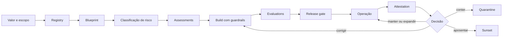

# Fundamentos de governança de IA e agentes

## Tese

Governança de agentes não é um approval adicional nem um produto isolado. É o sistema de decisões, controles, evidências e accountability que acompanha uma capacidade de IA desde a hipótese de valor até a aposentadoria.

O NIST AI RMF organiza o risco em `Govern`, `Map`, `Measure` e `Manage` e trata governança como função transversal, não como etapa final.[7] O perfil de GenAI reforça governança, provenance, testes pré-deployment e incident disclosure como considerações primárias.[8]

## Por que agentes mudam o problema

Um modelo produz saídas. Um agente combina modelo, contexto, memória, identidade, dados, ferramentas e lógica de orquestração para perseguir um objetivo. Quando pode executar ações, sua superfície de risco inclui:

- decidir com evidência incompleta;
- acessar dados fora da finalidade;
- propagar instruções maliciosas;
- encadear tools e ampliar blast radius;
- agir com identidade ou privilégio inadequado;
- repetir erro em escala e velocidade;
- produzir efeitos difíceis de reverter;
- esconder falhas atrás de dashboards agregados.

Por isso, o objeto de governança é o **sistema sociotécnico**, não apenas o modelo.

## Escopo do framework

O framework cobre:

- modelos generativos integrados a aplicações;
- copilots e assistentes;
- workflows com decisão ou conteúdo gerado por IA;
- agentes single e multi-agent;
- agentes com tools, APIs, browsers, código ou MCP;
- sistemas adquiridos, SaaS, low-code, no-code e pro-code;
- capacidades internas ou externas que afetem pessoas, dados, finanças ou operações.

Não é necessário chamar algo de “agente” para que os controles se apliquem. Capacidade e impacto importam mais que branding.

## Conceitos que não devem ser confundidos

| Conceito | Pergunta respondida |
|---|---|
| criação | quantos artefatos foram construídos? |
| descoberta | usuários encontram a capacidade certa? |
| adoção | pessoas incorporaram a capacidade ao trabalho? |
| uso | com que frequência e por quem ela é usada? |
| qualidade | funciona com precisão, segurança e utilidade suficientes? |
| valor | produziu outcome operacional, financeiro ou humano demonstrável? |

Volume de criação não demonstra adoção. Uso não demonstra qualidade. Satisfação não demonstra valor. ROI não deve ser inferido sem baseline, atribuição e evidência.

## Objetos canônicos

### Registry

Registro de o que existe, lifecycle, ownership, status, alcance, risco e links para evidências. É a fundação de visibilidade, mas não equivale à governança completa.

### Agent blueprint

Descrição técnica de arquitetura, modelos, dados, identidade, memória, tools, permissões, superfícies, dependências, guardrails e failure modes. Complementa o registry.

### Control

Requisito preventivo, detectivo, responsivo ou corretivo com owner, método de implementação e evidência esperada.

### Assessment

Avaliação contextual que identifica impacto, risco, adequação, mitigadores, residual risk e decisão necessária.

### Evidence package

Conjunto versionado de registros que permite reconstruir o que foi aprovado, testado, executado, observado e decidido.

## Princípios

1. **Mandato antes de automação:** sem propósito, owner e risk appetite, não há base legítima para operar.
2. **Proporcionalidade:** autonomia, alcance, criticidade, dados, conectores, reversibilidade e capacidade de ação determinam intensidade.
3. **Least privilege:** identidade, tools e dados recebem somente acesso necessário, por tempo e finalidade definidos.
4. **Separation of duties:** quem constrói não deve ser o único a avaliar ou aceitar risco relevante.
5. **Human accountability:** todo agente tem business owner e technical owner humanos.
6. **Evidence by design:** decisões e controles produzem evidência recuperável como parte do fluxo.
7. **Runtime matters:** testes de release não eliminam comportamento emergente, drift ou abuso.
8. **Reversibilidade:** rollback, quarantine, kill switch e sunset são requisitos de arquitetura, não planos tardios.
9. **Governança federada:** especialidades mantêm autoridade; contexto e controles comuns reduzem fragmentação.
10. **Neutralidade de plataforma:** produtos implementam capabilities; o framework define outcomes e evidências.

## Lifecycle canônico

Cada transição exige decision rights e evidência compatíveis com o tier de risco.

## Build time e runtime

### Build time

- business case e baseline;
- classificação de dados e conectores;
- workload identity e permissões;
- threat model e impact assessment;
- evals, red teaming e release evidence;
- rollback, containment e support readiness.

### Runtime

- comportamento, qualidade e drift;
- prompt injection e tool misuse;
- acessos, ações e trânsito de dados;
- incidentes e policy signals;
- contenção, remediação e reativação;
- attestation, value review e sunset.

Controle build-time sem runtime é confiança estática em sistema dinâmico. Runtime sem build-time transfere risco para resposta tardia.

## Governança coordenada e distribuída

Não se cria um novo silo central para decidir tudo. A governança funciona como rede de autoridades:

- negócio responde por finalidade e outcome;
- plataforma por capabilities e enforcement;
- identidade por autenticação e autorização;
- dados por classificação, finalidade e acesso;
- segurança por threat model, detecção e resposta;
- privacy, jurídico e Responsible AI por impactos e obrigações;
- operações por runtime e contenção;
- assurance por verificação independente.

O [operating model](../governance/operating-model.md) transforma essa rede em decision rights e handoffs explícitos.

## Hierarquia de evidência

1. **Evidência operacional observada:** logs, testes, incidentes e outcomes medidos.
2. **Evidência documental verificável:** decisões, assessments e configurações versionadas.
3. **Referência externa primária:** normas, regulação e documentação oficial.
4. **Estudo institucional:** relato de fornecedor ou Customer Zero, com limites declarados.
5. **Hipótese ou benchmark:** útil para planejar, não para afirmar eficácia.

A força da conclusão não pode exceder a força da evidência.

## O que o framework não garante

A adoção deste material não garante segurança, compliance, ética, ROI ou ausência de incidentes. O framework organiza decisões e evidências; eficácia depende da implementação, contexto, competências, supervisão e melhoria contínua.

## Sources

[7] <https://nvlpubs.nist.gov/nistpubs/ai/NIST.AI.100-1.pdf> — NIST AI Risk Management Framework 1.0
[8] <https://nvlpubs.nist.gov/nistpubs/ai/NIST.AI.600-1.pdf> — NIST AI 600-1 Generative AI Profile
