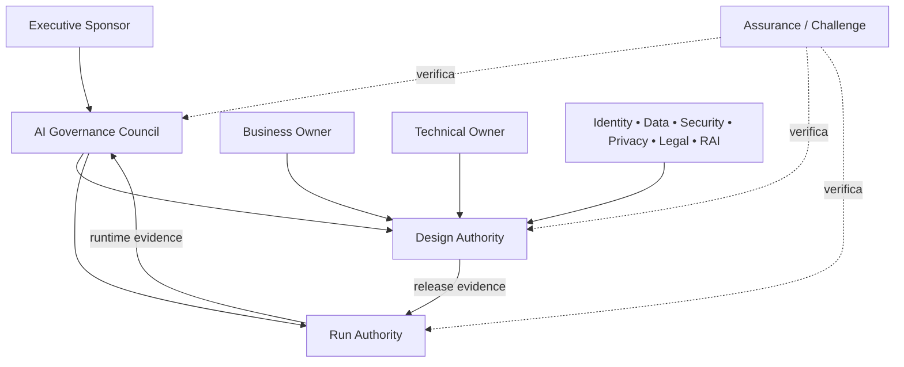

# Operating model e decision rights

## Objetivo

Converter princípios e policy em decisões executáveis, com autoridade, handoffs, evidências e tempos de resposta definidos. Este documento é guidance; não altera a [Policy v1](ai-agent-policy-and-governance-v1.md).

## Modelo federado

Governança é coordenada e distribuída. Um council comum define risk appetite, padrões mínimos e exceções; autoridades de domínio preservam suas competências e evidências.

## Papéis

### Executive Sponsor

- garante mandato, funding e alinhamento estratégico;
- aprova risk appetite e conflitos de prioridade;
- remove impedimentos que excedem authority operacional;
- não substitui owners nas decisões técnicas.

### AI Governance Council

- mantém policy, taxonomia, tiers e critérios comuns;
- resolve conflitos entre domínios;
- aprova exceções materiais e mudanças de risk appetite;
- revisa portfólio, incidentes sistêmicos e value evidence.

### Design Authority

- avalia blueprint, risco, arquitetura e release evidence;
- coordena identity, data, security, privacy e RAI;
- decide ou recomenda publicação conforme tier;
- devolve gaps com owner e critério de aceite.

### Run Authority

- define observabilidade, incidentes, quarantine e reactivation;
- pode conter agentes quando sinais ultrapassam limites aprovados;
- mantém escalations, SLOs e drills;
- não altera finalidade ou risco aceito sem voltar à Design Authority.

### Business Owner

- responde por finalidade, usuários, outcome e impacto;
- aceita residual risk quando autorizado;
- revisa valor, qualidade e continuidade;
- garante comunicação com pessoas afetadas.

### Technical Owner

- responde por blueprint, implementação, dependências e operações técnicas;
- mantém controls, evals, runbooks e evidências;
- comunica mudanças materiais;
- executa correção, rollback e sunset técnico.

### Domain Authorities

| Domínio | Authority primária |
|---|---|
| identidade | padrões de workload identity, autenticação e autorização |
| dados | classificação, finalidade, lineage, minimização e connector gates |
| segurança | threat model, security testing, monitoramento e resposta |
| privacy | DPIA/triggers, direitos, retenção e tratamento de dados pessoais |
| jurídico/compliance | obrigações, uso aceitável, contratos e restrições setoriais |
| Responsible AI | impacto, fairness, transparência, safety e human oversight |
| plataforma | capabilities, enforcement points, adapters e service health |

### Assurance / Challenge

- verifica design e operação sem assumir ownership da decisão;
- testa suficiência e integridade das evidências;
- registra findings, severity, divergência e prazo;
- não transforma ausência de finding em garantia absoluta.

Há três níveis distintos: self-check do control owner, peer challenge separado do build e independent assurance. `Independent` é uma propriedade do arrangement, não do nome do papel. Exige, no mínimo:

- ausência de responsabilidade por design, implementação e operação do objeto revisado;
- conflitos e serviços anteriores declarados e avaliados;
- reporting line e authority para publicar findings sem interferência;
- scope, criteria, population, sampling e evidence cutoff definidos;
- método, forma da conclusão, limitações, remediação e renewal aprovados.

Quando esses requisitos não estiverem demonstrados, use `peer challenge` ou `limited-scope review`. O mesmo fornecedor que diagnosticou, desenhou ou implementou não pode emitir independent assurance sobre o próprio trabalho sem uma regra institucional explícita de serviços incompatíveis e safeguards; este framework não presume que tais safeguards existam.

## Decision rights

| Decisão | Accountable | Consultados | Evidência mínima |
|---|---|---|---|
| aprovar propósito e baseline | Business Owner | Sponsor, Finance, usuários | business case e baseline |
| classificar tier de risco | Design Authority | Risk, RAI, Security, Data | registry, blueprint e assessment |
| conceder identidade/acesso | Domain Authority | Technical Owner | least-privilege mapping e expiry |
| aprovar tool ou MCP server | Tool Authority | Security, Data, Platform | provenance, scopes, threat model e kill switch |
| liberar para produção | Design/Release Authority | Owners e domínios aplicáveis | release package completo |
| conter ou quarentenar | Run Authority | Business/Technical Owner | signal, severity, scope e timestamp |
| reativar | Run + Design Authority | Domain Authorities | causa, correção e regression evidence |
| aceitar risco residual | Authority definida por tier | Legal, RAI, Security, negócio | residual risk, prazo e compensating controls |
| aprovar exceção | Governance Council ou delegado | owners afetados | rationale, owner, expiry e review |
| aposentar | Business Owner | Technical Owner, Run Authority | usage/value review, retention e sunset plan |

## Fóruns e cadência

| Fórum | Cadência sugerida | Saída |
|---|---|---|
| portfolio review | mensal ou trimestral | priorização, funding, duplicidade e sunset |
| design review | por mudança material | decisão, conditions e evidence gaps |
| runtime risk review | semanal ou por severidade | incidentes, quarantine, trends e remediation |
| control owner review | mensal | eficácia, exceções, SLA e automação |
| attestation | por tier, no máximo anual | reconfirmação ou retirada de aprovação |
| policy review | anual ou evento material | versão, rationale e migration plan |

Cadências são adaptadas ao contexto; eventos críticos ignoram o calendário e seguem incident response.

## Handoffs obrigatórios

1. **Estratégia → design:** propósito, owner, usuários, baseline e constraints.
2. **Design → assurance/challenge:** blueprint, dados, identidade, tools, risk tier e test plan.
3. **Assurance/challenge → release:** findings, residual risk, approvals e expiry.
4. **Release → run:** thresholds, telemetry, runbooks, quarantine e support owner.
5. **Run → governance:** incidentes, exceptions, value evidence e mudanças materiais.
6. **Governance → sunset:** decisão, retenção, comunicação, revogação e archive.

Um handoff sem owner receptor e evidência não está concluído.

## Segregation of duties por tier

| Tier | Separação mínima |
|---|---|
| baixo | technical owner pode executar; business owner aprova propósito |
| moderado | peer reviewer separado da execução de build valida release evidence |
| alto | Design Authority e domain authorities aplicáveis aprovam; conflitos são declarados |
| crítico | aprovação executiva ou comitê, challenge com segregation formal e runtime oversight contínuo; usar `independent assurance` somente se os requisitos acima forem demonstrados |

## Exceções

Toda exceção contém:

- requisito afetado;
- justificativa e impacto;
- owner nominativo;
- compensating controls;
- data de expiração;
- gatilho de revisão antecipada;
- plano de regularização ou sunset.

Exceção sem expiração é alteração de policy disfarçada.

## Métricas do operating model

- decisões dentro do SLA por tier;
- evidence packages devolvidos por falta de completude;
- exceções abertas, expiradas e reincidentes;
- tempo entre signal, decisão e contenção;
- porcentagem de agentes com owners e attestation válidos;
- findings por control domain e tempo de remediação;
- mudanças materiais não declaradas;
- decisões de manter, corrigir, restringir ou aposentar.

As métricas medem fluxo e controle; não substituem outcomes de negócio ou impacto responsável.

## Antiobjetivos

- criar um “time de governança” que absorve ownership dos demais;
- exigir o mesmo processo para todo risco;
- automatizar approvals antes de estabilizar policy e exceções;
- usar council como fila operacional;
- tratar registro, dashboard ou assinatura como prova isolada de eficácia.
