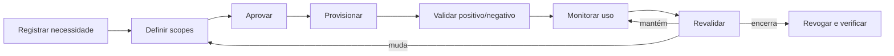

# Identidade de agentes e least privilege

## Objetivo

Garantir que cada agente, execução e ação possam ser atribuídos a uma identidade apropriada, com privilégios mínimos, finalidade, duração e owner verificáveis.

## Princípio

Agentes não devem herdar implicitamente a identidade ampla de um usuário, builder, service account compartilhada ou runtime genérico. A identidade precisa refletir **quem opera**, **qual agente executa**, **em nome de quem**, **para qual finalidade** e **sob quais limites**.

## Modelos de identidade

| Modelo | Uso aceitável | Risco principal |
|---|---|---|
| identidade do usuário delegada | ação interativa, no escopo do usuário | privilege laundering e consentimento ambíguo |
| workload identity do agente | execução autônoma ou serviço | privilégio persistente e ownerless identity |
| identidade por execução | tarefas efêmeras ou sensíveis | complexidade de emissão e correlação |
| service account compartilhada | legado temporário com waiver | baixa atribuição e blast radius amplo |
| credencial embutida | nenhum | segredo exposto e impossível de governar |

Service accounts compartilhadas exigem plano de eliminação, controles compensatórios e expiração da exceção.

## Requisitos mínimos

1. Cada agente possui business owner, technical owner e identidade registrada.
2. Produção usa identidade não humana quando a plataforma suporta.
3. Secrets não ficam em prompt, código, blueprint público ou configuração não protegida.
4. Scopes são derivados de tarefas aprovadas, não da conveniência do builder.
5. Acesso privilegiado é just-in-time, time-bound e reautorizado quando possível.
6. A identidade é revogada no sunset, troca de owner ou fim da finalidade.
7. Ações registram actor humano, agent identity, delegated subject e correlation ID quando aplicável.
8. Mudanças de role, scope, tenant, região ou credencial são material changes.
9. Break-glass possui authority, logging, alerta e revisão posterior.
10. O agente não pode conceder a si mesmo novos privilégios.

## Matriz de autorização

O blueprint deve mapear:

| Campo | Exemplo de decisão |
|---|---|
| recurso | sistema, API, dataset, fila ou tool |
| ação | read, write, approve, execute, delete, delegate |
| condição | ambiente, horário, região, valor ou tipo de dado |
| subject | workload, usuário delegado ou equipe |
| duração | sessão, tarefa, janela ou prazo |
| approval | automático, owner, dual control ou proibido |
| evidence | policy, role binding, token claim ou log |

Permissões em produção devem ser testadas com casos positivos e negativos.

## Delegação e “on behalf of”

Quando um agente atua em nome de um usuário:

- a interface deixa claro qual ação será executada;
- o consentimento cobre objeto, destino e efeito;
- o token não amplia privilégios do usuário;
- a decisão distingue recomendação, preparação e execução;
- ações irreversíveis exigem confirmação compatível com o risco;
- logs preservam usuário, agente, tool e resultado.

A delegação não transfere accountability do sistema para o usuário final.

## Lifecycle de identidade

## Controles por tier

| Tier | Controle adicional |
|---|---|
| baixo | identidade atribuível e scopes documentados |
| moderado | workload identity, expiry e teste negativo |
| alto | JIT, dual control para privilégio, session recording quando cabível |
| crítico | isolamento dedicado, autorização por transação e monitoramento contínuo |

## Evidências

- identity record e owner;
- role/scope mapping;
- configuração de autenticação;
- prova de armazenamento seguro de secrets;
- testes de autorização positiva e negativa;
- logs com correlation ID;
- attestation de acesso;
- evidência de revogação e orphan scan.

## Métricas

- agentes sem workload identity adequada;
- shared accounts e credenciais persistentes;
- scopes não usados ou excessivos;
- identities sem owner ou attestation;
- falhas de revogação;
- ações sem correlação entre usuário, agente e tool;
- exceções vencidas.

## Failure modes

- usar conta do builder em produção;
- compartilhar identidade entre múltiplos agentes;
- permitir refresh token sem prazo;
- confiar apenas no prompt para proibir ações;
- registrar “system” como actor de toda execução;
- manter acesso após sunset;
- tratar autenticação forte como autorização suficiente.

## Decision gate

Nenhum agente com capacidade de escrita, execução ou deleção passa pelo release gate sem identity model, permission matrix, testes negativos e revocation plan.
