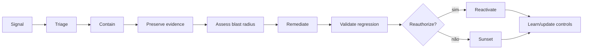

# Operações, observabilidade, resposta e lifecycle

## Objetivo

Operar agentes como sistemas dinâmicos: observar comportamento e efeitos, decidir, conter, remediar, revalidar e aposentar com responsabilidade definida.

## Run readiness

Antes do release, deve existir:

- Run Authority e technical owner;
- SLOs e error budgets adequados;
- telemetry e dashboards orientados a decisão;
- policy thresholds e alerts;
- incident severity matrix;
- runbooks de containment, rollback e reactivation;
- support model e escalation;
- change e attestation cadence;
- sunset e retention plan.

## Observability model

| Camada | Sinais |
|---|---|
| experiência | task success, user feedback, correction e abandonment |
| modelo | quality, safety, drift, refusal e uncertainty |
| retrieval/data | source, freshness, authorization e leakage |
| agent | plan depth, retries, loops e delegation |
| tool | allow/deny, latency, side effect, failure e cost |
| identity | authn/authz, scope e anomalies |
| business | outcome, error, control impact e value |
| governance | exception, finding, attestation e lifecycle status |

Dashboards precisam de owner, threshold e action; caso contrário são visualização, não governança.

## Incident lifecycle

## Containment ladder

1. negar operação específica;
2. reduzir scope ou rate;
3. bloquear tool/connector;
4. revogar identidade/token;
5. quarentenar agent/version;
6. rollback para versão conhecida;
7. desativar serviço ou integração;
8. executar sunset.

Escolha o menor blast radius que controla o risco; escale quando incerteza ou impacto exigirem.

## Quarantine

Quarantine deve:

- impedir novas ações relevantes;
- preservar logs e evidence;
- indicar status no registry;
- comunicar owners e suporte;
- evitar reativação automática;
- exigir cause, remediation e regression evidence;
- registrar authority e timestamps.

## Change management

Material changes reabrem gates proporcionais:

- model/provider;
- prompt/policy relevante;
- tool, MCP server ou permission;
- connector, dataset ou region;
- autonomy/capability;
- target population ou exposure;
- support/oversight mode;
- dependency com efeito de security ou reliability.

Mudanças emergenciais seguem break-glass e revisão posterior.

## Attestation

Periodic attestation confirma:

- owners válidos;
- finalidade e usuários atuais;
- risk tier e controls;
- identidade, dados e tools;
- evidence e exceptions;
- qualidade e incidents;
- uso e value evidence;
- necessidade de manter, corrigir, restringir ou aposentar.

Frequência aumenta com risco; evento material pode antecipar.

## Sunset

Sunset inclui:

- stop de novas utilizações;
- comunicação e alternativa;
- revogação de identidade, tokens, tools e connectors;
- tratamento de memória, indexes e records;
- retenção de evidência;
- remoção de discovery/catalog ativo;
- encerramento de contratos/custos quando aplicável;
- verificação de órfãos e dependências downstream.

## Evidências

- run readiness checklist;
- dashboards com owner/threshold/action;
- alerts e incident records;
- containment/rollback drills;
- change approvals;
- attestation;
- support tickets e user feedback;
- value review;
- sunset completion.

## Métricas

- mean time to detect, decide, contain e recover;
- incidents por severity e recurrence;
- failed actions, loops e retries;
- policy denials e anomalous tool chains;
- agents com expired attestation;
- orphaned identity/tool/data access;
- change sem reauthorization;
- quarantine/reactivation outcomes;
- inactive agents ainda gerando custo.

## Failure modes

- monitorar somente uptime;
- alert sem owner ou runbook;
- quarantine que não revoga tool access;
- reativar antes de regression test;
- alterar prompt em produção sem version;
- attestation como assinatura sem evidência;
- manter agent sem uso por medo de sunset;
- encerrar UI e deixar integrações ativas.

## Decision gate

Produção exige Run Authority, observability, containment, rollback, incident process, support e sunset verificáveis.
