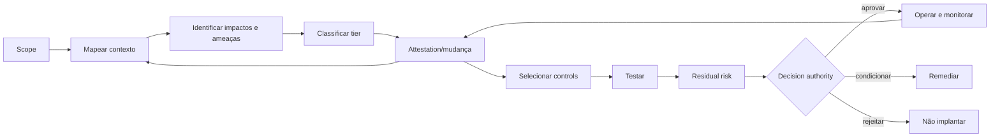

# Gestão proporcional de riscos de IA e agentes

## Objetivo

Classificar risco de forma contextual, aplicar controls compatíveis, registrar residual risk e revisar continuamente quando contexto ou comportamento mudam.

O NIST AI RMF trata gestão de risco como atividade contínua ao longo do lifecycle.[7] A legislação europeia exige sistema de risco estabelecido, implementado, documentado e mantido para sistemas classificados como high-risk.[12] Este framework usa essas referências como alinhamento, sem afirmar equivalência regulatória.

## Risco não é um número isolado

A avaliação combina:

```text
Risk posture = impacto × likelihood × exposição × autonomia
               × capacidade de ação × irreversibilidade
               ajustado por controls e detectability
```

Não existe fórmula universal. Scoring apoia consistência; a decisão preserva contexto e rationale.

## Dimensões

| Dimensão | Perguntas |
|---|---|
| finalidade | qual decisão, processo ou direito pode ser afetado? |
| alcance | quantas pessoas, sistemas, regiões ou transações? |
| dados | sensibilidade, qualidade, origem e obrigações? |
| autonomia | recomenda, prepara, executa, aprova ou delega? |
| capability | read, write, action, workflow, code ou physical effect? |
| interconectividade | quantos tools, agents, APIs e downstream systems? |
| reversibilidade | efeito pode ser desfeito com custo e tempo aceitáveis? |
| detectability | falha aparece antes do impacto? |
| exposição | interno, externo, público ou adversarial? |
| vulnerabilidade | pessoas ou grupos podem sofrer impacto desproporcional? |
| contexto legal | há obrigação setorial, regional, contratual ou trabalhista? |
| novidade | há evidência operacional comparável ou elevada incerteza? |

## Tiers

T1–T4 é a taxonomia canônica de risco/criticidade da policy de governança de agentes. Uma organização pode mapear classificações locais, regulatórias ou legadas, desde que preserve os critérios, documente divergências e aplique o caminho decisório mais restritivo quando houver ambiguidade.

| Tier | Perfil | Exemplo de controle |
|---|---|---|
| T1 — baixo | sugestão interna, dados não sensíveis, reversível | owner, registry, testes básicos e logging |
| T2 — moderado | influência operacional limitada ou dados internos | blueprint, reviewer independente, evals e monitoring |
| T3 — alto | escrita/ação, dados sensíveis, alto alcance ou impacto | domain approvals, threat/impact assessment, kill switch e attestation |
| T4 — crítico | efeito legal, financeiro, safety-critical ou difícil de reverter | authority executiva, dual control, challenge com segregation formal e containment contínuo; `independent assurance` somente se os requisitos institucionais de independência estiverem demonstrados |

### Red flags e escaladores

Red flags elevam a criticidade **independentemente do score**. Existem porque uma média esconde um fator crítico: um caso com dez respostas benignas e uma destrutiva não é um caso médio.

Qualquer red flag retira o caso do fast path. A coluna de criticidade é **piso, não teto** — o scoring pode chegar mais alto, nunca mais baixo.

| Red flag | Criticidade mínima | Efeito adicional | Pergunta no pre-screen |
|---|---|---|---|
| dados restritos enviados a provedor externo | **T4** | admissibilidade `restricted` por padrão: default deny, com exceção explícita, authority e expiry | 1 |
| descoberta irrestrita de tools ou MCP externos em runtime | **T4** | admissibilidade `restricted` por padrão; o conjunto de capacidades deixa de ser conhecido no momento da aprovação | 8 |
| execução de código ou comandos arbitrários | **T4** | mediação obrigatória e isolamento; sem allowlist, a capability é ilimitada por construção | 9 |
| deleção irreversível ou mudança destrutiva | **T4** | dual control onde aplicável; contenção testada antes do release | 3 |
| modificação de identidade, permissão ou secrets | **T3** | o agente passa a poder ampliar o próprio privilégio; segregação e logging forense | 10 |
| acesso privilegiado ou administrativo | **T3** | JIT e monitoramento contínuo; privilégio permanente exige justificativa própria | 5 |
| decisão sobre emprego, crédito, elegibilidade ou acesso a serviço | **T3** | impact assessment formal obrigatório e canal de contestação, mesmo em caso tecnicamente simples | 6 |
| processo safety-critical ou de tecnologia operacional | **T3** | domain review do processo físico; failure containment exercitado | 7 |
| execução de transação financeira material | **T3** | limite por transação e por período, reconciliação e rollback testado | 2 e 3 |
| comunicação pública autônoma e em escala, sem revisão humana | **T3** | as três condições somadas — pública, autônoma e em escala — é que fazem o escalador; separadas, cada uma é menos grave | 4 e 14 |

Duas observações sobre a coluna de admissibilidade. Primeiro, red flags governam **criticidade**; apenas os dois primeiros carregam um default de admissibilidade, porque neles a restrição é do uso em si, não da severidade do impacto. Segundo, `restricted` **por padrão** não significa proibido: significa que operar exige exceção registrada, e não silêncio.

A lista acima é a norma; o [pre-screen](../../templates/risk-pre-screen.md) é o instrumento. Se divergirem, a lista prevalece e o instrumento é corrigido — nunca o contrário.

### Fast path de T1

Em estates com alto volume de casos simples, exigir revisão humana caso a caso transforma a governança em gargalo — e a organização passa a contorná-la. O fast path é a rota **automatizada** de T1, preservada pela [ADR-0009](../architecture/decisions/0009-risk-tier-and-admissibility.md).

O fast path elimina revisão manual caso a caso. Ele **não** elimina controle. Permanecem obrigatórios:

- descoberta e registro com `agent_id` e owner atribuído;
- logging básico e telemetria mínima recuperável;
- uso restrito a fontes de dados e tools já aprovadas;
- termos de uso aceitos pelo owner;
- evidência proporcional e recuperável da classificação.

A saída do fast path é **automática**: qualquer red flag, escalador ou impact trigger remove o agente da rota rápida e exige a rota do tier resultante. A entrada é que precisa ser conquistada — na dúvida, o caso não entra.

Materiais externos que usem uma faixa `T0` convergem para T1: `T0` e `T1` externos mapeiam para o T1 canônico. Os demais rótulos precisam ser decompostos em criticidade e admissibilidade; `Restricted` do guia v3.4 mapeia para admissibilidade, não redefine T4.

## Admissibilidade é uma dimensão separada

Risk tier responde **quão severo pode ser o impacto**. Admissibilidade responde **se e sob quais condições o uso pode operar**. Um T1 pode ser proibido por finalidade ou obrigação legal; um T4 pode ser admitido quando authority, controls e evidências compatíveis existirem.

| Admissibilidade | Regra de decisão |
| --- | --- |
| `permitted` | pode operar dentro do blueprint e dos controls aprovados |
| `conditional` | pode operar somente enquanto condições documentadas forem satisfeitas |
| `restricted` | default deny; exige exceção explícita, temporária, com authority e expiry |
| `prohibited` | não entra nem permanece em produção no escopo avaliado |

Tier e admissibilidade são registrados juntos no [Agent Risk Record](../../templates/agent-risk-record.md), no Registry, no Blueprint e no release evidence manifest. Mudança em qualquer dimensão é mudança material.

O piso de controles exigido por tier para entrar e permanecer em produção está no [Minimum Production Bar](minimum-production-bar.md).

## Processo



## Playbook do fluxo risco → impacto → aprovação

Classificação, impact assessment e aprovação não são três aprovações concorrentes. Resolvem problemas diferentes e operam em sequência.

1. **Pre-screen no intake** com perguntas objetivas sobre dados, autonomia, ações, pessoas afetadas e alcance. Use o [template de risk pre-screen](../../templates/risk-pre-screen.md).
2. **Calcular o risco base e aplicar os red flags.** O score apoia consistência; os red flags impedem que um fator crítico seja diluído por uma média.
3. **Definir o tier preliminar e a admissibilidade.** Tier determina proporcionalidade; admissibilidade determina se o uso é permitido, condicionado, restrito ou proibido.
4. **Selecionar os controles obrigatórios** correspondentes, conforme o [Minimum Production Bar](minimum-production-bar.md).
5. **Aplicar o impact trigger screen.** O agente influencia direitos, oportunidades, acesso a serviços, decisões sobre pessoas, segurança física, comunicação pública ou processo regulado? Se sim, executa-se o [impact assessment](../responsible-ai/README.md#impact-assessment) formal — **mesmo em caso tecnicamente simples**.
6. **Acionar domain reviews apenas quando relevantes.** Privacidade por dados pessoais; segurança por ferramentas e privilégio; dados por fontes; arquitetura por mudança de pattern; jurídico por obrigação aplicável. Review acionada por regra fixa vira fila.
7. **Registrar riscos, admissibilidade, mitigações, residual risk e owner.** **Nenhuma review aprovada deve existir sem residual risk explícito** e sem a authority compatível com o tier e a admissibilidade.
8. **Compilar o evidence pack.** O gate de publicação verifica a evidência exigida pelo tier — ele não refaz as reviews. Ver [evidence pack por tier](../auditability/evidence-pack-by-tier.md).
9. **Após mudança material, o reassessment recomeça do ponto afetado**, não do zero. Reassessment integral por padrão é caro, e o que é caro deixa de ser feito.

## Risk register mínimo

- risk ID e categoria;
- scenario e affected parties;
- source/cause;
- likelihood, impact e uncertainty;
- existing controls e eficácia observada;
- residual risk;
- admissibilidade, rationale, condições ou exception/expiry;
- owner e decision authority;
- treatment, due date e status;
- indicators e escalation threshold;
- evidências;
- review trigger e expiry.

## Categorias

- business/value e uso inadequado;
- fairness e impacto em pessoas;
- privacy e data protection;
- security e adversarial misuse;
- safety e harmful content;
- reliability, quality e hallucination;
- identidade, autorização e excessive agency;
- tool/MCP e supply chain;
- operações, resilience e incident response;
- jurídico, regulatório e propriedade intelectual;
- reputação, comunicação e transparência;
- concentração, vendor e systemic risk;
- environmental e resource consumption quando material.

## Risk acceptance

Acceptance exige:

- risco descrito em linguagem de negócio;
- controls existentes e limitações;
- residual risk e incerteza;
- authority compatível com tier;
- prazo e gatilhos de revisão;
- compensating controls quando aplicável;
- opção de não implementar ou reduzir scope.

Risk acceptance não transforma uso `prohibited` em permitido. Para uso `restricted`, a exceção é registro distinto, temporário e revogável.

Risco não pode ser “aceito” pelo technical owner se o impacto pertence ao negócio, a pessoas ou a obrigação de outro domínio.

## Mudança material

Reclassificar quando muda:

- finalidade ou população;
- modelo ou provider relevante;
- dados, connector ou região;
- identidade, scope ou tool;
- autonomia ou capability;
- volume, alcance ou criticidade;
- UI/approval flow;
- incident, finding ou external threat;
- obrigação legal ou risk appetite.

## Evidências

- context map;
- impact/threat assessments;
- tier rationale;
- control mapping;
- test results;
- residual risk decision;
- runtime indicators;
- incidents e remediação;
- attestation e reclassification history.

## Métricas

- riscos sem owner ou due date;
- findings e exceptions vencidos;
- tier changes após incidentes;
- controls sem evidence de eficácia;
- tempo entre trigger e reavaliação;
- residual risks sem authority adequada;
- concentração por provider, modelo ou tool;
- incidentes por categoria e recurrence.

## Antipatterns

- score único sem narrativa;
- classificar risco apenas pelo número de usuários;
- usar “PoC” como sinônimo de baixo risco;
- copiar thresholds de outro contexto;
- zerar risco porque existe approval;
- aceitar risco sem expiry;
- medir apenas likelihood e impact, ignorando detectability e reversibilidade;
- congelar classificação após release.

## Sources

[7] <https://nvlpubs.nist.gov/nistpubs/ai/NIST.AI.100-1.pdf> — NIST AI Risk Management Framework 1.0
[12] <https://eur-lex.europa.eu/eli/reg/2024/1689/oj/eng> — Regulation (EU) 2024/1689 — Artificial Intelligence Act
