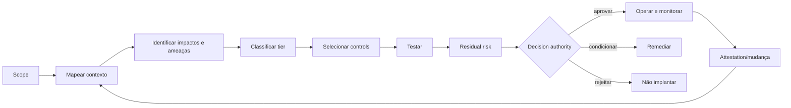

# Gestão proporcional de riscos de IA e agentes

## Objetivo

Classificar risco de forma contextual, aplicar controls compatíveis, registrar residual risk e revisar continuamente quando contexto ou comportamento mudam.

O NIST AI RMF trata gestão de risco como atividade contínua ao longo do lifecycle.[7] A legislação europeia exige sistema de risco estabelecido, implementado, documentado e mantido para sistemas classificados como high-risk.[12] Este framework usa essas referências como alinhamento, sem afirmar equivalência regulatória.

## Risco não é um número isolado

A avaliação combina:

```text
Risk posture = impacto × likelihood × exposição × autonomia
               × capacidade de ação × irreversibilidade
               ajustado por controls e detectability
```

Não existe fórmula universal. Scoring apoia consistência; a decisão preserva contexto e rationale.

## Dimensões

| Dimensão | Perguntas |
|---|---|
| finalidade | qual decisão, processo ou direito pode ser afetado? |
| alcance | quantas pessoas, sistemas, regiões ou transações? |
| dados | sensibilidade, qualidade, origem e obrigações? |
| autonomia | recomenda, prepara, executa, aprova ou delega? |
| capability | read, write, action, workflow, code ou physical effect? |
| interconectividade | quantos tools, agents, APIs e downstream systems? |
| reversibilidade | efeito pode ser desfeito com custo e tempo aceitáveis? |
| detectability | falha aparece antes do impacto? |
| exposição | interno, externo, público ou adversarial? |
| vulnerabilidade | pessoas ou grupos podem sofrer impacto desproporcional? |
| contexto legal | há obrigação setorial, regional, contratual ou trabalhista? |
| novidade | há evidência operacional comparável ou elevada incerteza? |

## Tiers

T1–T4 é a taxonomia canônica de risco da policy modular. Uma organização pode mapear classificações locais, regulatórias ou legadas, desde que preserve os critérios, documente divergências e aplique o caminho decisório mais restritivo quando houver ambiguidade.

| Tier | Perfil | Exemplo de controle |
|---|---|---|
| T1 — baixo | sugestão interna, dados não sensíveis, reversível | owner, registry, testes básicos e logging |
| T2 — moderado | influência operacional limitada ou dados internos | blueprint, reviewer independente, evals e monitoring |
| T3 — alto | escrita/ação, dados sensíveis, alto alcance ou impacto | domain approvals, threat/impact assessment, kill switch e attestation |
| T4 — crítico | efeito legal, financeiro, safety-critical ou difícil de reverter | authority executiva, dual control, challenge com segregation formal e containment contínuo; `independent assurance` somente se os requisitos institucionais de independência estiverem demonstrados |

Red flags podem elevar o tier independentemente do score: decisão sobre direitos, dados altamente sensíveis, ações financeiras, produção industrial crítica, acesso privilegiado, público externo, code execution ou impossibilidade de rollback.

### Fast path de T1

Em estates com alto volume de casos simples, exigir revisão humana caso a caso transforma a governança em gargalo — e a organização passa a contorná-la. O fast path é a rota **automatizada** de T1, definida na [ADR-0004](../architecture/decisions/0004-risk-tier-taxonomy-and-fast-path.md).

O fast path elimina revisão manual caso a caso. Ele **não** elimina controle. Permanecem obrigatórios:

- descoberta e registro com `agent_id` e owner atribuído;
- logging básico e telemetria mínima recuperável;
- uso restrito a fontes de dados e tools já aprovadas;
- termos de uso aceitos pelo owner;
- evidência proporcional e recuperável da classificação.

A saída do fast path é **automática**: qualquer red flag, escalador ou impact trigger remove o agente da rota rápida e exige a rota do tier resultante. A entrada é que precisa ser conquistada — na dúvida, o caso não entra.

Materiais externos que usem uma faixa `T0` convergem para T1: `T0` e `T1` externos mapeiam para T1 canônico; `T2`, `T3` e `T4` permanecem equivalentes.

## Processo



## Risk register mínimo

- risk ID e categoria;
- scenario e affected parties;
- source/cause;
- likelihood, impact e uncertainty;
- existing controls e eficácia observada;
- residual risk;
- owner e decision authority;
- treatment, due date e status;
- indicators e escalation threshold;
- evidências;
- review trigger e expiry.

## Categorias

- business/value e uso inadequado;
- fairness e impacto em pessoas;
- privacy e data protection;
- security e adversarial misuse;
- safety e harmful content;
- reliability, quality e hallucination;
- identidade, autorização e excessive agency;
- tool/MCP e supply chain;
- operações, resilience e incident response;
- jurídico, regulatório e propriedade intelectual;
- reputação, comunicação e transparência;
- concentração, vendor e systemic risk;
- environmental e resource consumption quando material.

## Risk acceptance

Acceptance exige:

- risco descrito em linguagem de negócio;
- controls existentes e limitações;
- residual risk e incerteza;
- authority compatível com tier;
- prazo e gatilhos de revisão;
- compensating controls quando aplicável;
- opção de não implementar ou reduzir scope.

Risco não pode ser “aceito” pelo technical owner se o impacto pertence ao negócio, a pessoas ou a obrigação de outro domínio.

## Mudança material

Reclassificar quando muda:

- finalidade ou população;
- modelo ou provider relevante;
- dados, connector ou região;
- identidade, scope ou tool;
- autonomia ou capability;
- volume, alcance ou criticidade;
- UI/approval flow;
- incident, finding ou external threat;
- obrigação legal ou risk appetite.

## Evidências

- context map;
- impact/threat assessments;
- tier rationale;
- control mapping;
- test results;
- residual risk decision;
- runtime indicators;
- incidents e remediação;
- attestation e reclassification history.

## Métricas

- riscos sem owner ou due date;
- findings e exceptions vencidos;
- tier changes após incidentes;
- controls sem evidence de eficácia;
- tempo entre trigger e reavaliação;
- residual risks sem authority adequada;
- concentração por provider, modelo ou tool;
- incidentes por categoria e recurrence.

## Antipatterns

- score único sem narrativa;
- classificar risco apenas pelo número de usuários;
- usar “PoC” como sinônimo de baixo risco;
- copiar thresholds de outro contexto;
- zerar risco porque existe approval;
- aceitar risco sem expiry;
- medir apenas likelihood e impact, ignorando detectability e reversibilidade;
- congelar classificação após release.

## Sources

[7] <https://nvlpubs.nist.gov/nistpubs/ai/NIST.AI.100-1.pdf> — NIST AI Risk Management Framework 1.0
[12] <https://eur-lex.europa.eu/eli/reg/2024/1689/oj/eng> — Regulation (EU) 2024/1689 — Artificial Intelligence Act
