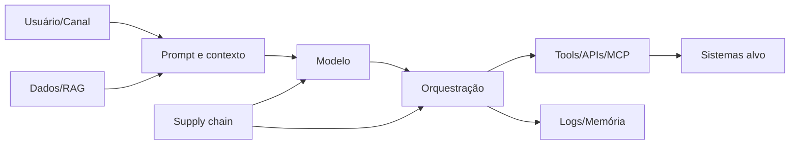

# Segurança de sistemas de IA e agentes

## Objetivo

Aplicar security engineering ao sistema completo: modelo, prompts, retrieval, memória, identidade, tools, supply chain, runtime e pessoas.

O OWASP GenAI Security Project produz orientação para riscos de LLMs, sistemas agentic e aplicações orientadas por IA.[15] MITRE ATLAS é usado como fonte complementar para threat-informed defense; mappings precisam ser revisados conforme versão da base.

## Superfície de ataque

Ataques e falhas podem entrar por qualquer nó e se propagar pelos handoffs.

## Threat categories

- direct e indirect prompt injection;
- tool poisoning e descrição maliciosa;
- data poisoning e retrieval manipulation;
- model, prompt ou dependency supply chain compromise;
- secret leakage e credential misuse;
- excessive agency e authorization bypass;
- insecure output handling;
- memory poisoning e cross-session contamination;
- denial of wallet/service;
- exfiltration por output, tool, log ou side channel;
- unsafe code execution;
- multi-agent trust transitivity;
- monitoring evasion e evidence tampering.

## Secure-by-design requirements

1. Trust boundaries aparecem no blueprint e threat model.
2. Conteúdo externo e recuperado nunca define policy ou autorização.
3. Identity e authorization são aplicadas fora do modelo.
4. Tools usam allowlist, schema e least privilege.
5. Code execution é sandboxed, resource-bound e sem secrets por padrão.
6. Egress é deny-by-default nos tiers altos.
7. Inputs, outputs e side effects recebem validação contextual.
8. Dependencies, models, prompts e MCP servers têm provenance/versioning.
9. Logs são protegidos contra alteração e acesso excessivo.
10. Kill switch e quarantine são independentes da lógica do agente.
11. Security tests cobrem chains, não apenas componentes isolados.
12. Incidentes alimentam regression tests e risk review.

## Threat modeling

O threat model declara:

- assets e impactos;
- trust boundaries;
- adversários e misuse cases;
- entry points e egress;
- identity/data/tool flow;
- side effects e blast radius;
- controls preventivos, detectivos e responsivos;
- residual risk e owner;
- testes e telemetry necessários.

Mudança de modelo, tool, connector, privilege, exposure ou data class reabre a análise.

## Testing strategy

| Camada | Testes |
|---|---|
| componente | prompt injection, output validation, authz e sandbox |
| chain | indirect injection, tool sequence, data exfiltration e rollback |
| system | red team, abuse cases, load/cost e incident drill |
| runtime | canaries, anomaly signals, policy denials e regression |

LLM-as-judge pode auxiliar triagem; não é evidência única para riscos críticos.

## Runtime response

- identificar agent, version, user, tool e affected assets;
- conter identidade, tool, connector ou agente no menor blast radius;
- preservar evidências;
- avaliar propagação para memórias, indexes e downstream systems;
- corrigir causa, não apenas prompt;
- executar regression e reauthorization;
- comunicar conforme severidade e obrigação;
- atualizar threat model e control catalog.

## Playbook de implantação

AgentSecOps conecta prevenção, detecção, contenção e investigação. Opera como extensão das práticas existentes de segurança, com riscos adicionais: prompt injection, uso indevido de ferramentas, autoridade delegada, envenenamento de memória e comportamento autônomo.

1. **Modelar ameaças por fluxo e trust boundary.** Partir do diagrama de runtime e identificar assets, atores, dados, modelos, ferramentas, conteúdo externo e pontos de controle. **Incluir abuso legítimo de permissões**, não apenas atacante externo.
2. **Construir catálogo de abuse cases.** Injeção que leva a uso indevido de ferramenta; envenenamento de memória que altera decisão futura; servidor MCP comprometido que oferece ferramenta maliciosa; loop descontrolado que gera custo e ação repetida; identidade de agente usada fora do runtime.
3. **Mapear controles preventivos.** Least privilege, allowlist de ferramentas, isolamento de conteúdo, gateway de policy, validação de parâmetros, sandbox, cofre de secrets, restrições de saída e aprovação humana para ação material.
4. **Definir sinais de detecção com owner.** Correlacionar anomalia de autenticação, acesso a dados, frequência de ferramentas, alvos incomuns, negações de policy, pico de custo, destinos externos e desvio de comportamento. Cada sinal precisa de severidade **e** owner.
5. **Escrever runbooks de contenção.** Cada um declara quando desabilitar identidade, ferramenta, provedor, connector ou o agente inteiro; como preservar evidência; **quem pode executar sem aprovação adicional**; e como restaurar.
6. **Diferenciar quarentena, kill switch e rollback.** Quarentena preserva o ativo para investigação com operação bloqueada; kill switch interrompe rapidamente uma capacidade; rollback retorna versão ou configuração. Um incidente pode exigir os três em sequência.
7. **Preparar forensics e evidência.** Garantir retenção e correlação de eventos, chamadas de ferramenta, resultados de autorização, versão de modelo e de policy, e mudanças. Definir o tratamento de dados sensíveis **dentro dos próprios logs**.
8. **Executar tabletop e tuning contínuo.** Ao menos um incidente T2/T3 simulado por trimestre no início. Medir tempo até detecção, tempo até quarentena, clareza da authority e lacunas de evidência; findings recorrentes viram melhoria de plataforma, não item de checklist.

## Evidências

- blueprint com trust boundaries;
- threat model e misuse cases;
- provenance/SBOM quando aplicável;
- security test results;
- sandbox/egress configuration;
- vulnerability e patch records;
- incident e containment drills;
- runtime alerts e policy denials;
- residual risk acceptance.

## Métricas

- coverage de threat models e security tests;
- prompt/tool injection success rate em teste;
- actions blocked por policy;
- mean time to contain e recover;
- secrets ou sensitive data em traces;
- assets sem provenance;
- regressions por mudança material;
- repeat findings e exceptions vencidas.

## Failure modes

- “o system prompt proíbe” usado como controle principal;
- red team sem cenários de tool e data flow;
- scan de dependência sem provenance de modelo/prompt;
- logar tudo e criar novo data breach;
- permitir egress amplo em sandbox;
- bloquear UI mas deixar API aberta;
- corrigir incidente sem revalidar memória e indexes;
- tratar output filter como segurança completa.

## Sources

[15] <https://owasp.org/www-project-top-10-for-large-language-model-applications> — OWASP Top 10 for Large Language Model Applications
