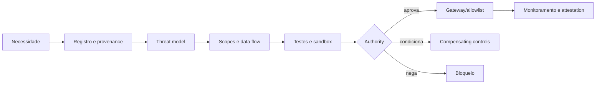

# Governança de tools, APIs e MCP

## Objetivo

Controlar a descoberta, aprovação, concessão, execução e revogação de capacidades que permitem a um agente observar ou alterar sistemas.

A OWASP mantém referências específicas para ameaças agentic e destaca que a combinação de LLMs com sistemas autônomos amplia capacidades e riscos.[14] O domínio de tools deve ser tratado como superfície de segurança e de decisão, não como conveniência de integração.

## Taxonomia de capacidades

| Classe | Exemplos | Risco-base |
|---|---|---|
| observe | search, read, list, inspect | exposição e inferência |
| create | criar draft, ticket ou arquivo | conteúdo incorreto e spam |
| modify | atualizar record, config ou workflow | corrupção e efeito operacional |
| execute | rodar código, comando ou job | compromisso de sistema |
| approve | liberar pagamento, acesso ou mudança | quebra de segregation of duties |
| delete | apagar dado ou recurso | irreversibilidade |
| delegate | criar subagente ou conceder acesso | propagação e perda de controle |

Risco real combina classe, dados, identity, alcance, reversibilidade, frequência e encadeamento.

## Tool registry

Cada tool, API ou MCP server registra:

- owner e fornecedor/origem;
- versão, hash ou provenance do pacote;
- operações e schemas;
- identity model e scopes;
- dados acessados e destinos;
- network endpoints e regiões;
- side effects e reversibilidade;
- rate limits, quotas e custo;
- logs e correlation IDs;
- approval mode;
- kill switch e revocation path;
- vulnerabilities, findings e validade da aprovação.

O contrato mínimo vendor-neutral está no [Enterprise Tool Registry schema](../../schemas/enterprise-tool-registry.schema.json), com [exemplo preenchido](../../examples/enterprise-tool-registry.example.json). O registry pode viver em GRC, CMDB, catálogo de API ou plataforma equivalente; o importante é o binding estável `catalogEntryId` usado pelo Blueprint e pelos audit events.

## MCP governance

MCP padroniza acesso a tools e contexto; não padroniza confiança. Um servidor MCP pode alterar descrições, tools, resources e prompts e deve ser governado como software com autoridade.

### Requisitos mínimos para MCP

1. Discovery somente em registries aprovados ou allowlists.
2. Provenance e versão fixadas quando tecnicamente possível.
3. Tool descriptions tratadas como input não confiável.
4. Gateway ou enforcement point aplica identidade, scopes e policy.
5. Egress e destinos são limitados.
6. Operações state-changing são diferenciadas de read-only. Na taxonomia estruturada v1.0, `create` significa criar ou persistir um artefato/registro fora da resposta transitória do modelo e, portanto, exige `stateChanging: true`; geração puramente transitória não deve ser classificada como tool `create`.
7. Argumentos e resultados são validados por schema.
8. Sensitive data é filtrado antes do envio.
9. Logs preservam servidor, tool, versão, argumentos protegidos e outcome.
10. Kill switch revoga o server sem depender do agente.
11. Mudanças materiais exigem reavaliação.
12. Sampling, roots e callbacks são explicitamente autorizados.

## Fluxo de aprovação

## Enforcement patterns

- **Tool allowlist:** catálogo fechado por tier e ambiente.
- **Policy gateway:** valida caller, tool, arguments, destination e context.
- **Human confirmation:** mostra ação, alvo e efeito antes de executar.
- **Transaction limit:** restringe valor, volume, frequência ou horário.
- **Sandbox:** isola filesystem, network e processo.
- **Two-person rule:** separa preparação e aprovação em ações críticas.
- **Dry run:** calcula mudanças antes de commit.
- **Kill switch:** remove capacidade imediatamente.

Prompt instructions não substituem enforcement técnico.

## Build-time controls

- threat model por classe de tool;
- dependency/provenance scan;
- schema validation;
- positive, negative e adversarial tests;
- idempotency e rollback tests;
- sandbox e egress tests;
- rate/cost controls;
- approval UX test.

## Runtime controls

- anomaly detection por identidade, tool e sequência;
- policy denial e alerting;
- correlation entre intenção, chamada e efeito;
- circuit breaker;
- quarantine do agente ou tool;
- audit de mudança de versão/capabilities;
- periodic re-attestation.

## Playbook de implantação

Tools, APIs, connectors e MCP são a superfície onde o agente deixa de interpretar informação e passa a **agir**. Por isso a capacidade de ação precisa de classificação e autorização próprias, mesmo quando o agente já tem um tier.

1. **Descobrir e registrar tools e servidores MCP.** Registry com owner, endpoint, autenticação, dados tocados, classes de ação, ambientes, consumidores e lifecycle. Descoberta automática ajuda; ownership e autorização precisam ser confirmados por pessoa.
2. **Classificar ações, não produtos.** Uma API contém operações de riscos distintos. Separar leitura e busca, criação e atualização, exclusão e execução, privilegiada e administrativa, financeira e safety-critical. **O controle acompanha a ação específica.**
3. **Definir tiers permitidos e pré-condições.** Para cada classe de ação: quais tiers podem consumi-la, identidade mínima, classe de dados, oversight humano e ambiente. Ação de alto impacto é default deny salvo exceção explícita.
4. **Autorizar por parâmetros.** Validar alvo, valor, escopo, recurso e constraints no gateway ou broker. **O modelo pode propor parâmetros; nunca deve ser a autoridade que decide se são permitidos.**
5. **Governar MCP como camada de confiança.** Registrar owner do servidor, ferramentas expostas, versão, autenticação, origem, fronteira de rede e política de descoberta. Descoberta externa ilimitada e servidores não aprovados não pertencem a agentes de produção.
6. **Mediar ações materiais.** O broker aplica policy, rate limit, aprovações, validação de parâmetros e logging. Para ações privilegiadas, vincular a aprovação ao artefato da **ação exata**, não a uma sessão.
7. **Definir quotas, circuit breakers e idempotência.** Um agente em loop repete ações válidas até causar dano. Limitar chamadas, custo, concorrência e retries; usar chave de idempotência e circuit breaker onde a operação suportar.
8. **Monitorar e versionar mudanças.** Alteração de schema, autenticação, ação permitida ou servidor MCP pode ser mudança material. A telemetria precisa correlacionar `agent_id` → ferramenta → ação → resultado → decisão de policy.

## Evidências

- tool registry record;
- [Enterprise Tool Registry estruturado](../../schemas/enterprise-tool-registry.schema.json);
- provenance e versão;
- threat model;
- permission matrix;
- test results;
- gateway/policy configuration;
- approval/denial logs;
- rollback e kill-switch drill;
- exception e expiry;
- attestation.

## Métricas

- tools e servers não registrados;
- chamadas negadas por policy;
- scopes não usados;
- state-changing calls sem approval correto;
- tempo para revogar uma tool;
- versão fora de baseline;
- ações sem correlation ID;
- exceptions vencidas;
- custo ou volume fora de envelope.

## Antipatterns

- MCP irrestrito;
- tool description confiada como policy;
- standing privilege para “facilitar” operação;
- shared identity;
- approval apenas no front-end;
- log sem side effect real;
- kill switch que exige redeploy completo;
- auto-descoberta de tools em produção sem allowlist;
- cadeia de tools sem limite de profundidade ou budget.

## Decision gate

Nenhuma tool state-changing entra em produção sem owner, provenance, scopes, threat model, enforcement, rollback e kill switch verificáveis.

## Sources

[14] <https://genai.owasp.org/resource/agentic-ai-threats-and-mitigations> — OWASP Agentic AI Threats and Mitigations

Para tools e MCP servers de terceiros, as exigências contratuais estão em [cláusulas mínimas de contrato com fornecedor de IA](../../templates/ai-vendor-contract-clauses.md).
